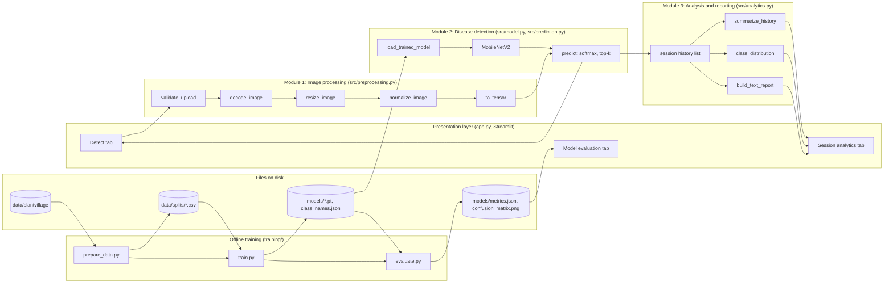
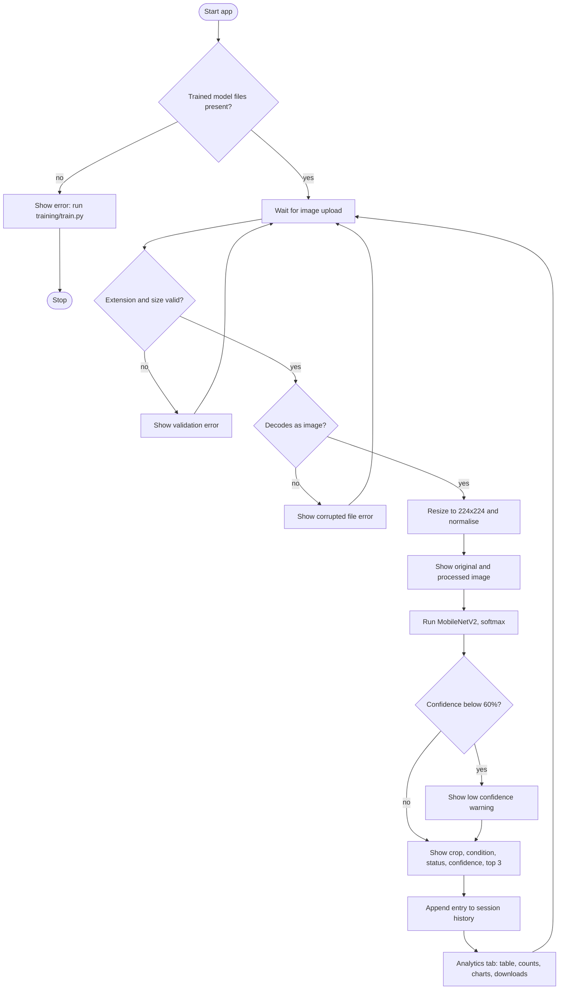
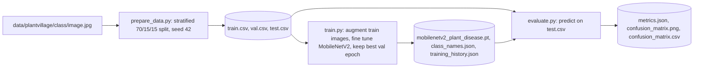
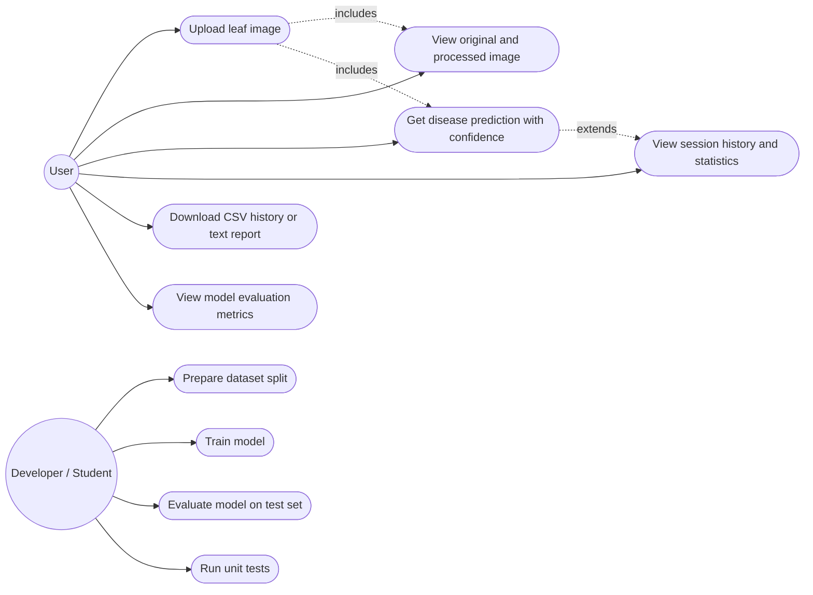
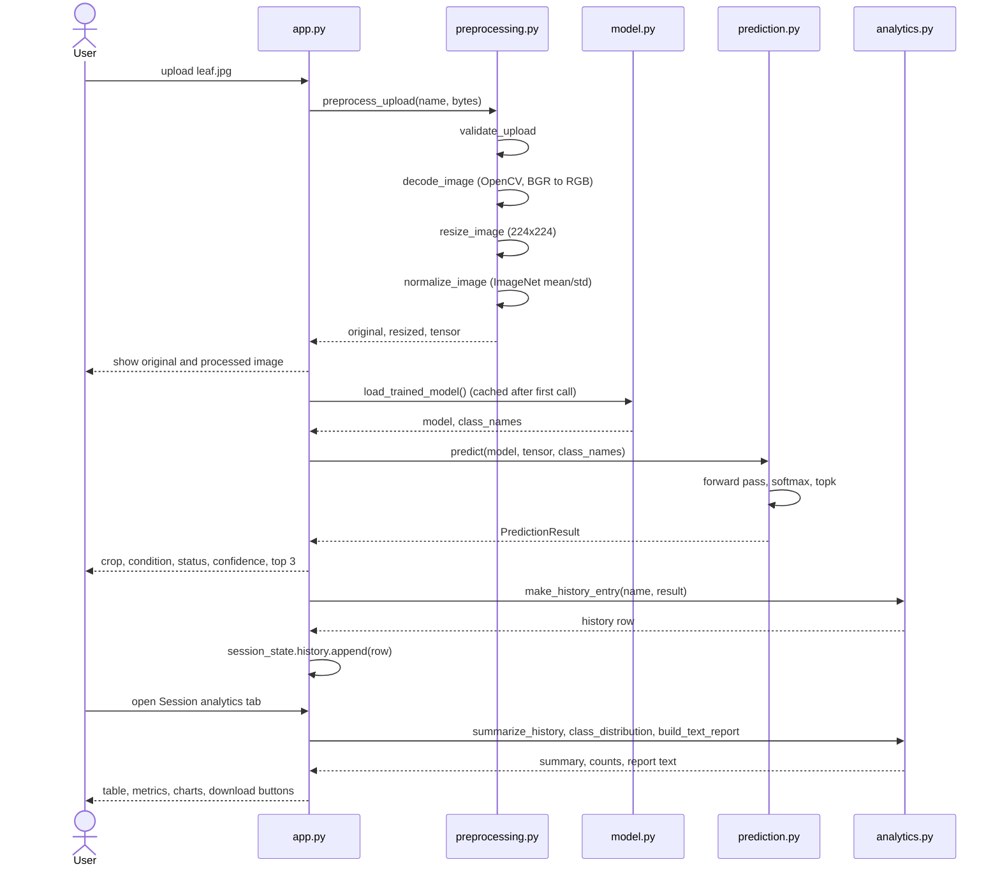
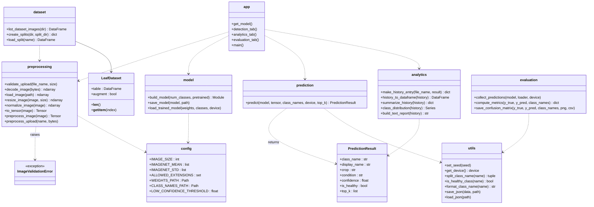

# Design Diagrams

All diagrams are written in Mermaid so they can be rendered on GitHub or pasted into
https://mermaid.live to export PNG images for the report. Each diagram describes the
code as it actually exists in this repository.

There is no ER diagram because the project has no database. Prediction history is a
Python list stored in Streamlit session state and is discarded when the browser tab
closes. The only files written to disk are produced by the training scripts
(weights, class list, metrics, confusion matrix).

## 1. System Architecture Diagram

## 2. Workflow Diagram (user interaction)

## 3. Training Workflow Diagram

## 4. Use Case Diagram

Mermaid has no native use case shape, so actors are shown as rounded nodes and use
cases as ellipses.

## 5. Sequence Diagram (single prediction)

## 6. Class / Component Diagram

