# 2. Introduction

Leaf images are one of the easiest signals to collect about the health of a crop. A farmer or gardener can photograph a leaf with a phone in seconds, but reading that photo correctly needs experience. Many diseases look alike in their early stage, and the same disease looks different on different crops.

This project applies image classification, one of the core problems in Computer Vision, to that task. A convolutional neural network (MobileNetV2) that was pretrained on ImageNet is fine tuned on the PlantVillage dataset of leaf photographs. The trained network is wrapped in a small Streamlit web application. The user uploads a leaf image, the application shows the preprocessing steps, predicts the crop and condition, reports the confidence, and keeps a session history with basic statistics and a downloadable report.

The aim was a complete working system whose every layer can be explained, with accuracy measured on a held out test set rather than guessed. Section 8 gives the reason behind each technique. All results in this report were produced by the scripts in the repository on 11 September 2026 and copied from the files they wrote, so none of the numbers are estimates.

# 3. Problem Statement

Given a photograph of a single plant leaf, determine automatically whether the leaf is healthy or diseased, identify the crop and the specific disease when one is present, and express how confident the system is in that answer.

Constraints that shaped the solution:

* It must run on a normal laptop. Training should finish in minutes on a consumer GPU and prediction should take well under a second on a CPU.
* It must reject bad input (wrong file type, corrupted file, empty file) with a clear message instead of crashing.
* Its accuracy must be measured on images that were never used during training.
* The code must be small enough for a student to explain in a viva.

## 3.1 Objectives

1. Build a preprocessing pipeline (decode, resize, normalise) that is shared by training and inference so the model always receives identically prepared input.
2. Fine tune a lightweight pretrained CNN on a public leaf disease dataset with a reproducible train, validation and test split.
3. Evaluate the model with accuracy, precision, recall, F1 score and a confusion matrix.
4. Provide a web interface that shows the original and processed image, the prediction, the confidence and a session level analysis with export.
5. Cover the preprocessing, prediction and analytics code with unit tests.

## 3.2 Scope

In scope: image upload with validation, a visible preprocessing pipeline, classification into the 38 PlantVillage crop and condition classes, prediction output with confidence and top three alternatives, a session history with summary statistics and export, evaluation on a held out test set, and unit tests.

Out of scope: crops that are not in the training dataset, locating the diseased region inside the image, treatment recommendations, user accounts, a database, and hosted deployment.

## 3.3 Target Users

The main audience is students and instructors who want a working example of transfer learning for image classification. Agriculture students and hobby gardeners can also use it for a quick first opinion on a leaf photo, and the system is small enough to study before building a larger one.

# 4. Functional Requirements

The system has three major functional modules. Each maps to one source file and one part of the interface.

## 4.1 FR1: Image Processing (src/preprocessing.py)

Table 1: Image processing requirements

| ID | Requirement | Where implemented |
|----|-------------|-------------------|
| FR1.1 | Accept an uploaded image in JPG, JPEG or PNG format | `validate_upload`, `st.file_uploader(type=[...])` |
| FR1.2 | Reject files with any other extension with a readable message | `validate_upload` raises `ImageValidationError` |
| FR1.3 | Reject empty files and files above 10 MB | `validate_upload` |
| FR1.4 | Reject files that cannot be decoded as an image (corrupted data) | `decode_image` raises an error when OpenCV cannot decode |
| FR1.5 | Convert grayscale and RGBA input to 3 channel RGB | `decode_image` |
| FR1.6 | Resize every image to 224 x 224 pixels | `resize_image` (OpenCV, area interpolation) |
| FR1.7 | Scale pixels to [0, 1] and normalise with ImageNet mean and std | `normalize_image` |
| FR1.8 | Show the original and the processed image side by side, with the tensor statistics | `show_preprocessing` in `app.py` |

## 4.2 FR2: Disease Detection (src/model.py, src/prediction.py)

Table 2: Disease detection requirements

| ID | Requirement | Where implemented |
|----|-------------|-------------------|
| FR2.1 | Load the fine tuned MobileNetV2 weights and the class list once and reuse them | `load_trained_model`, cached with `st.cache_resource` |
| FR2.2 | Show a clear error when no trained model exists instead of a stack trace | `load_trained_model` raises `FileNotFoundError` with instructions |
| FR2.3 | Predict one of the 38 crop and condition classes for a preprocessed image | `predict` |
| FR2.4 | Return a confidence value in [0, 1] computed with softmax | `predict` |
| FR2.5 | Report whether the leaf is healthy or diseased | `is_healthy_class`, `PredictionResult.is_healthy` |
| FR2.6 | List the top three classes with their probabilities | `PredictionResult.top_k` |
| FR2.7 | Warn the user when the confidence is below 60% | `show_prediction` in `app.py` |

## 4.3 FR3: Analysis and Reporting (src/analytics.py)

Table 3: Analysis and reporting requirements

| ID | Requirement | Where implemented |
|----|-------------|-------------------|
| FR3.1 | Keep every prediction of the current session in memory | `st.session_state.history` |
| FR3.2 | Show the history as a table (time, file, crop, condition, status, confidence) | `history_to_dataframe` |
| FR3.3 | Show counts of images analysed, healthy and diseased, mean confidence, most frequent class | `summarize_history` |
| FR3.4 | Show a bar chart of the predicted class distribution and per prediction confidence | `class_distribution`, `st.bar_chart` |
| FR3.5 | Export the history as CSV and a text report | `build_text_report`, `st.download_button` |
| FR3.6 | Clear the history on request | Clear history button |
| FR3.7 | Show the test set metrics, per class scores, training curve and confusion matrix | `evaluation_tab` |

## 4.4 Input and Output Structure

* Input: one image file (JPG or PNG) chosen by the user in the browser.
* Output for one image: crop, condition, status (healthy or diseased), confidence percentage, top three classes, and a warning if the confidence is low.
* Output for the session: history table, summary counts, charts, CSV file, text report.

# 5. Non-functional Requirements

Table 4: Non-functional requirements and how each is met

| ID | Category | Requirement | How it is met |
|----|----------|-------------|---------------|
| NFR1 | Performance | A prediction for one image completes in under one second on a CPU and the model loads only once per server process | MobileNetV2 has 2,272,550 parameters. The model is cached with `st.cache_resource`. Measured CPU inference time is 17.9 ms to 44.8 ms depending on machine load (section 10). |
| NFR2 | Usability | A user with no ML background can get a result in one step: upload an image. Results use plain words (crop, condition, healthy or diseased) and a percentage | Single file uploader, three tab layout, readable labels produced by `format_class_name`, an expander that explains the preprocessing steps |
| NFR3 | Reliability and error handling | Invalid input never crashes the app. Every failure (wrong type, empty, oversized, corrupted, missing model) produces a specific message and the app keeps running | `ImageValidationError` caught in `detection_tab`, `FileNotFoundError` caught in `main`, all covered by unit tests and browser checks |
| NFR4 | Maintainability | The code is split into single purpose modules, all settings live in one config file, and there are no machine specific paths | `config.py` builds paths from `__file__`, seven source modules, three training scripts, four test files |
| NFR5 | Resource efficiency | Training fits in 6 GB of GPU memory and the saved model is under 10 MB so it can be committed to Git | Batch size 64 at 224 x 224 with MobileNetV2; the weights file is 9.34 MB |
| NFR6 | Reproducibility and logging | The data split is exactly repeatable, training is seeded, and every training run is logged | Fixed seed 42 gives the identical split every time and the split is stored as CSV. Training also seeds PyTorch, but GPU convolution kernels and data loader workers are not fully deterministic, so a retrain gives numbers close to, not identical to, the reported ones. `models/training.log` records every epoch of the run that produced the committed weights. |

# 6. System Architecture

The system has five parts. The first three run inside the Streamlit process when a user interacts with the app. The training pipeline runs offline, before the app is used, and its outputs on disk are the only link between training and the app.

1. Presentation layer (`app.py`). Draws the page, receives the uploaded file, calls the three modules and shows their results. It holds the session history in `st.session_state`.
2. Image processing module (`src/preprocessing.py`). Pure functions that turn file bytes into a normalised tensor. No Streamlit code inside, so the same functions are used by the training data loader and the tests.
3. Disease detection module (`src/model.py`, `src/prediction.py`). Builds the MobileNetV2 architecture, loads the saved weights, and converts network output into a `PredictionResult`.
4. Analysis and reporting module (`src/analytics.py`). Works only on the in memory history list. Produces a DataFrame, summary numbers, chart data and a text report.
5. Offline training pipeline (`training/`). Three scripts that read the dataset folder, write the split CSVs, fine tune the network and evaluate it.

Data flows in one direction: file bytes to tensor to logits to `PredictionResult` to history row to summary.

Storage: there is no database. The only persistent files are written by the training scripts. The application itself writes nothing to disk. For this reason no ER diagram or schema design is included, as allowed by the guideline ("if applicable").

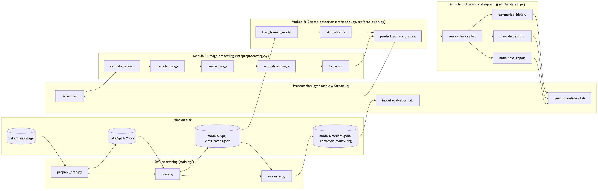

# 7. Design Diagrams

All diagrams were written in Mermaid (source in `docs/diagrams.md`), rendered with the Mermaid library and exported as PNG. Each one describes the code as it exists in the repository.

## 7.1 Use Case Diagram

Two actors use the system. The end user works only through the browser. The developer or student runs the training scripts and the tests from the command line.

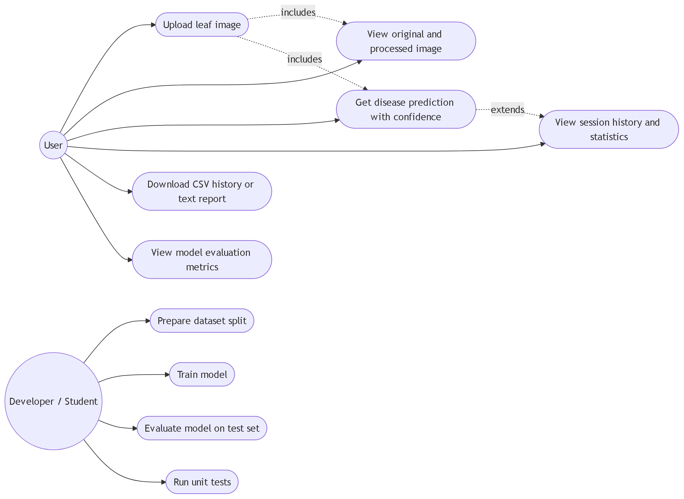

## 7.2 Workflow Diagram

The user workflow starts when the app loads the trained model. Every upload passes through validation, decoding, resizing and normalisation before the network runs. Low confidence results get a warning. Every successful prediction is appended to the session history, which feeds the analytics tab.

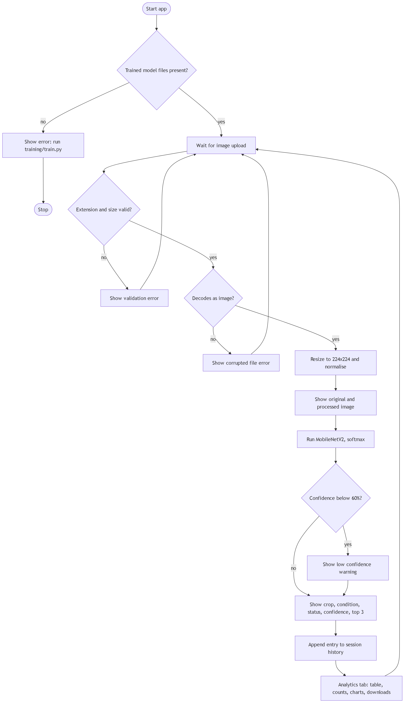

The training workflow is separate and runs before the app is used.

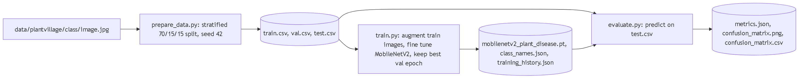

## 7.3 Sequence Diagram

The sequence diagram follows one upload through the modules and into the history.

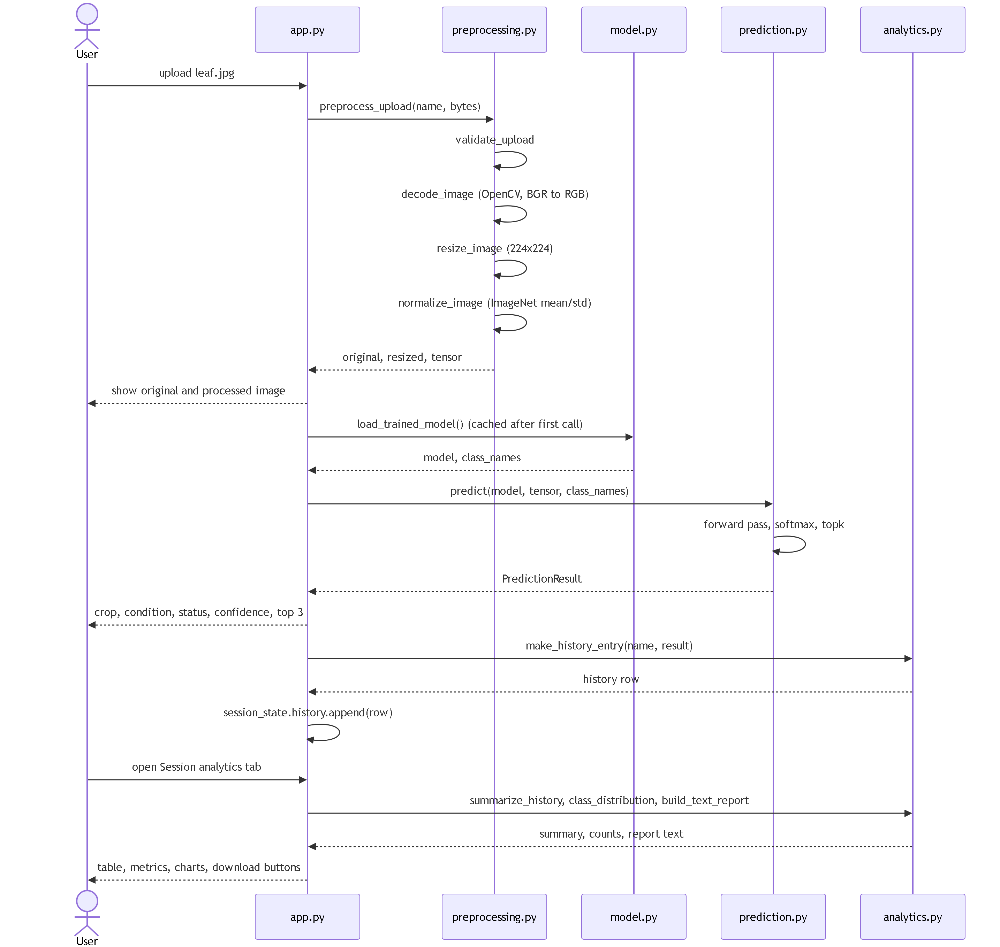

## 7.4 ER Diagram

Not applicable. Prediction history is a Python list in Streamlit session state and is discarded when the browser tab is closed. The application has no tables, schema or database connection.

## 7.5 Class / Component Diagram

The project is mostly functions grouped in modules, so the diagram shows each module as a component with its public functions, plus the two real classes (`LeafDataset`, `PredictionResult`) and the custom exception.

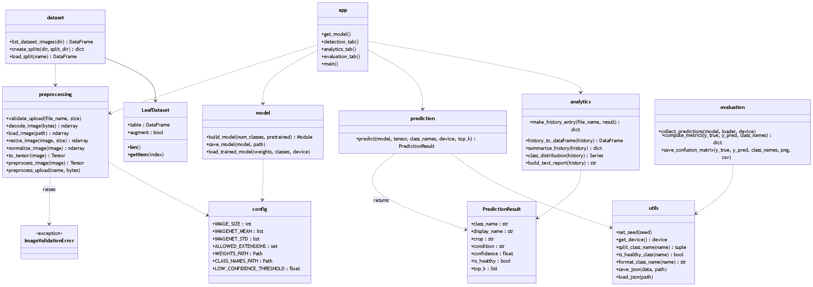

# 8. Design Decisions and Rationale

The network is fine tuned from ImageNet weights instead of trained from scratch. A CNN trained from random weights needs a lot of images and many epochs before it learns even the basic filters for edges, colour blobs and textures, and MobileNetV2 already has those from ImageNet. Only the last layer is replaced. The whole network is then fine tuned with a small learning rate (0.0001) so the pretrained features are adjusted rather than destroyed. This reached 98.05% validation accuracy after the first epoch.

MobileNetV2 was chosen over ResNet50 and EfficientNet. Its depthwise separable convolutions and inverted residual blocks give it about one tenth of the parameters of ResNet50, so it trains faster, its weights file is small enough to commit to Git, and a CPU prediction takes milliseconds. That capacity is enough for 38 visually distinct classes of leaf images, which the test results confirm. EfficientNet would give similar accuracy at a similar size, but its compound scaling is harder to explain in a viva. ResNet50 would be slower with no benefit here.

Input is 224 x 224 with ImageNet normalisation because those are the exact conditions under which the pretrained weights were learned. A different input size, or skipping normalisation, would make the first layers see a distribution they were not trained on.

OpenCV does the decoding and resizing. It is fast, handles JPG and PNG including alpha and grayscale, and `cv2.imdecode` returns `None` for corrupted data, which is a clean way to detect bad files. Resizing uses area interpolation because almost every upload is larger than 224 pixels and area interpolation avoids aliasing when shrinking.

Training and inference share one preprocessing function. The data loader (`LeafDataset`) and the app both call `preprocess_image`, so the model cannot receive differently prepared input in training and in use. That mismatch is a common source of accuracy loss in deployed classifiers.

Augmentation is applied only to the training split: random horizontal and vertical flips, rotation up to 20 degrees, and mild brightness, contrast and saturation jitter. Leaves have no fixed orientation and lighting varies between photos, so these produce realistic variations. Validation and test images are never augmented, otherwise the reported metrics would not reflect real use.

The data is split 70 / 15 / 15 with stratification, and the split is saved as CSV. Stratification keeps the class proportions the same in all three sets. A fixed seed and saved CSV files mean the split never changes between runs, and the test set can be shown to have zero path overlap with training. Keeping the best validation epoch, not the last one, guards against overfitting.

Confidence is the softmax probability of the top class, with a warning below 60%. Softmax is the standard way to turn logits into a probability distribution. The warning tells the user that the top class did not clearly win, for example when the photo is blurry or shows a crop the model never saw.

History lives in Streamlit session state, not in a database. The guideline asks for reporting or analytics, not for persistence, and session state is enough for a per session history without inventing a schema that nothing needs. CSV and text export give the user a way to keep the results.

Streamlit is the interface. It runs as one Python file, needs no HTML or JavaScript, and its widgets (file uploader, metrics, tables, bar charts, download buttons) cover everything the three modules need to display.

# 9. Implementation Details

## 9.1 Technology Stack

Table 5: Tools used

| Purpose | Tool |
|---------|------|
| Deep learning | PyTorch 2.10.0 (CUDA 12.8 build), torchvision 0.25.0 (MobileNetV2 weights) |
| Image processing | OpenCV (opencv-python-headless), NumPy |
| Metrics | scikit-learn (accuracy, precision, recall, F1, confusion matrix, stratified split) |
| Plots | matplotlib (confusion matrix image), Streamlit built in charts |
| Interface | Streamlit |
| Tables and export | pandas |
| Tests | pytest, Streamlit AppTest, Playwright (optional browser checks) |
| Language | Python 3.11.9 on Windows 11 |
| Hardware | Laptop with NVIDIA GeForce RTX 3050 6 GB |

## 9.2 Dataset

PlantVillage (Hughes and Salathe, 2015), colour images, downloaded from the public GitHub mirror `spMohanty/PlantVillage-Dataset` (folder `raw/color`). It contains leaf photographs of 14 crops in 38 classes. Every class name has the form `Crop___Condition`, for example `Tomato___Late_blight` or `Apple___healthy`. Twelve crops have one healthy class each; two crops (orange and squash) only have a disease class. The dataset is not included in the repository because of its size.

Table 6: Dataset and split, as printed by `training/prepare_data.py`

| Item | Value |
|------|-------|
| Classes | 38 |
| Crops | 14 |
| Total images | 54,305 |
| Training images (70%) | 38,013 |
| Validation images (15%) | 8,145 |
| Test images (15%) | 8,147 |
| Random seed | 42 |
| Smallest class | Potato healthy, 152 images |
| Largest class | Orange Haunglongbing, 5,507 images |
| Overlap between splits by file path | 0 images |

Because of the class imbalance the split is stratified and macro averaged metrics are reported alongside accuracy.

The photos were taken on a plain background in a lab setting, so the model is expected to be less accurate on field photos with soil, hands or several leaves in the frame. A second limitation of the dataset is discussed in section 10.5.

## 9.3 Preprocessing Pipeline (Module 1)

```
bytes -> cv2.imdecode -> BGR to RGB -> cv2.resize(224, 224, INTER_AREA)
      -> divide by 255 -> (x - mean) / std -> transpose to (C, H, W) -> torch tensor
```

Each step is one function in `src/preprocessing.py`, and `preprocess_upload` chains them for the app. The app shows the shape, minimum, maximum and mean of the final tensor so the effect of normalisation is visible.

## 9.4 Model (Module 2)

`build_model` loads `torchvision.models.mobilenet_v2` with ImageNet weights and replaces `classifier[1]` (a `Linear(1280, 1000)`) with `Linear(1280, 38)`. The dropout layer before it is kept. Training uses cross entropy loss and the Adam optimiser with learning rate 0.0001, batch size 64, for 5 epochs. After each epoch the validation accuracy is computed and the weights are saved only when it improves.

`predict` runs a forward pass without gradient tracking, applies softmax across the class dimension, and takes the top three probabilities. The healthy flag is derived from the class name.

## 9.5 Analytics (Module 3)

The history is a list of dictionaries with keys time, file, crop, condition, status and confidence. pandas converts it to a DataFrame for the table, `value_counts` gives the class distribution, and a few aggregations give the summary. The text report is built with plain string formatting so it can be read anywhere.

## 9.6 Error Handling Strategy

* File validation errors are a custom exception (`ImageValidationError`) so the app can distinguish them from programming errors and show the message text directly.
* A corrupted file produces the same exception from `decode_image`.
* A missing model file produces a `FileNotFoundError` whose message tells the user which script to run.
* The Streamlit uploader itself restricts the file picker to jpg, jpeg and png, so the extension check is a second line of defence that also protects the function when it is called from tests or other code.

## 9.7 Logging

`train.py` writes every epoch's loss, accuracy and duration to `models/training.log` and to the console. `training_history.json` stores the same numbers in a form the app can plot.

## 9.8 Project Structure

```
Plant-Disease-Detection-and-Analysis-System/
  app.py                     Streamlit interface
  config.py                  paths, image size, hyperparameters
  requirements.txt
  README.md
  statement.md
  src/
    preprocessing.py         Module 1
    model.py                 Module 2 (network)
    prediction.py            Module 2 (inference)
    analytics.py             Module 3
    dataset.py               split creation and Dataset class
    evaluation.py            metrics and confusion matrix
    utils.py                 seeds, device, class name helpers
  training/
    prepare_data.py          build train/val/test CSVs
    train.py                 fine tune MobileNetV2
    evaluate.py              test set metrics
  tests/
    conftest.py              synthetic image fixtures
    test_preprocessing.py
    test_prediction.py
    test_analytics.py
    test_app.py              runs app.py under Streamlit AppTest
    browser_check.py         optional Playwright checks of the running app
  models/                    weights, class list, metrics, confusion matrix, log
  assets/                    samples, screenshots, rendered diagrams
  docs/                      report content, diagrams, results, test results
  data/                      dataset (not in Git) and split CSVs
```

# 10. Screenshots and Results

Every number in this section was produced by the scripts in the repository on 11 September 2026 and copied from `models/metrics.json`, `models/training_history.json`, `models/confusion_matrix.csv` and the console output.

## 10.1 Training

Command: `python training/train.py` with the defaults from `config.py` (5 epochs, batch size 64, Adam, learning rate 0.0001, 4 data loader workers).

Table 7: Training history from `models/training_history.json`

| Epoch | Train loss | Train accuracy | Validation loss | Validation accuracy | Time |
|-------|-----------|----------------|-----------------|---------------------|------|
| 1 | 0.3837 | 91.37% | 0.0672 | 98.05% | 401 s |
| 2 | 0.0606 | 98.31% | 0.0532 | 98.22% | 299 s |
| 3 | 0.0408 | 98.78% | 0.0267 | 99.18% | 261 s |
| 4 | 0.0287 | 99.10% | 0.0281 | 99.13% | 228 s |
| 5 | 0.0260 | 99.22% | 0.0194 | 99.47% | 229 s |

Total training time: 23.6 minutes. The epoch 5 weights had the best validation accuracy and were saved. The first epoch is slower because the operating system file cache was still cold.

Training accuracy stays slightly below validation accuracy throughout. That is expected: augmentation and dropout are only active during training, so the training images are harder than the clean validation images.

## 10.2 Test Set Evaluation

Command: `python training/evaluate.py` on the 8,147 test images, which were never used for training or for choosing the best epoch. All numbers below are accuracy on the held out PlantVillage test split, not accuracy on field photographs.

Table 8: Metrics on the held out test split from `models/metrics.json`

| Metric | Value |
|--------|-------|
| Accuracy | 99.25% |
| Macro precision | 99.00% |
| Macro recall | 98.82% |
| Macro F1 score | 98.89% |
| Weighted F1 score | 99.25% |
| Misclassified images | 61 of 8,147 |
| Classes with a perfect F1 of 1.00 | 12 of 38 |

Table 9: Lowest scoring classes

| Class | Precision | Recall | F1 | Test images |
|-------|-----------|--------|----|-------------|
| Corn (maize) Cercospora leaf spot / Gray leaf spot | 0.957 | 0.870 | 0.912 | 77 |
| Tomato Early blight | 0.917 | 0.953 | 0.935 | 150 |
| Corn (maize) Northern Leaf Blight | 0.923 | 0.980 | 0.950 | 147 |
| Potato healthy | 1.000 | 0.913 | 0.955 | 23 |
| Tomato Late blight | 0.996 | 0.951 | 0.973 | 287 |

Table 10: Most frequent confusions from `models/confusion_matrix.csv`

| Count | True class | Predicted class |
|-------|-----------|-----------------|
| 10 | Corn Cercospora / Gray leaf spot | Corn Northern Leaf Blight |
| 6 | Tomato Late blight | Tomato Early blight |
| 4 | Tomato Septoria leaf spot | Tomato Early blight |
| 4 | Tomato Late blight | Potato Late blight |
| 3 | Tomato Early blight | Tomato Target Spot |
| 3 | Corn Northern Leaf Blight | Corn Cercospora / Gray leaf spot |

These pairs make sense. The two corn leaf diseases both produce elongated grey brown lesions, and the tomato blights and spots all appear as dark patches with rings. Late blight looks similar on tomato and potato because it is the same pathogen.

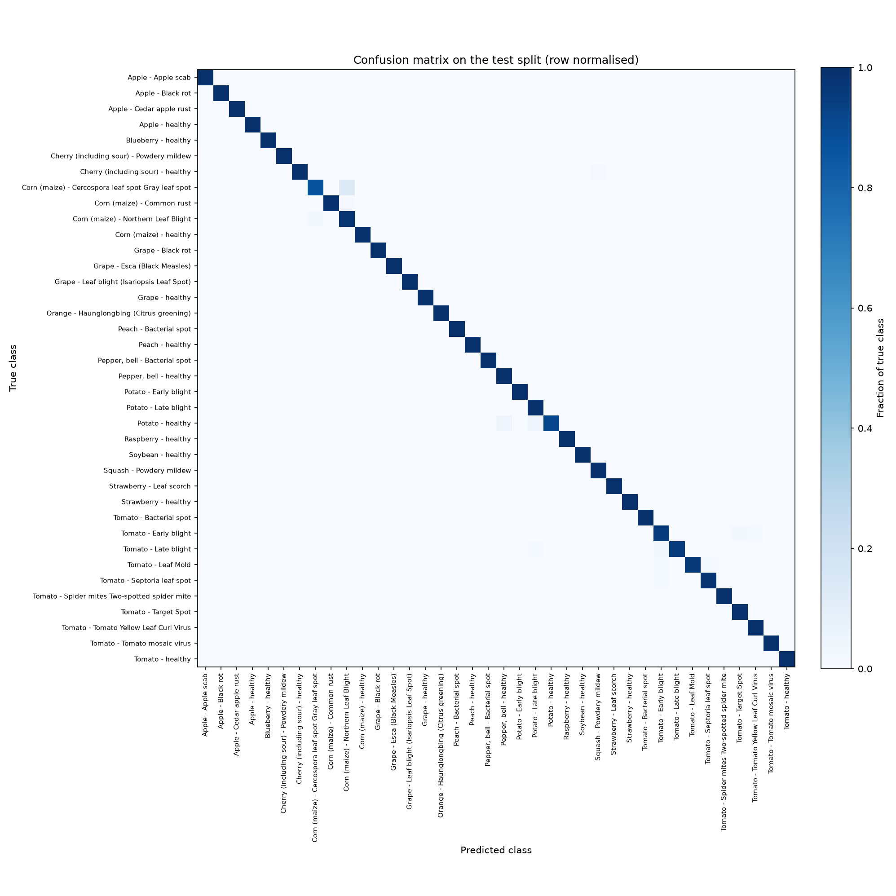

## 10.3 Model Size and Speed

Table 11: Size and inference time

| Item | Value |
|------|-------|
| Trainable parameters | 2,272,550 |
| Saved weights file | 9.34 MB |
| CPU inference time, first measurement (mean of 10 runs after warm up, taken right after the GPU evaluation) | 44.8 ms, slowest 48.8 ms |
| CPU inference time, second measurement (mean of 20 runs after warm up, idle machine) | 17.9 ms, fastest 14.3 ms, slowest 22.8 ms |

Both CPU numbers were measured on the laptop processor with the batch size 1 path used by the app (`predict` on an already preprocessed tensor), so they exclude image decoding and page rendering. The two runs differ because of background load on the machine at the time. Either way the performance requirement (NFR1) of under one second is met by a wide margin.

## 10.4 Screenshots

All screenshots were taken from the running app with the trained model, by the browser check script described in section 11.

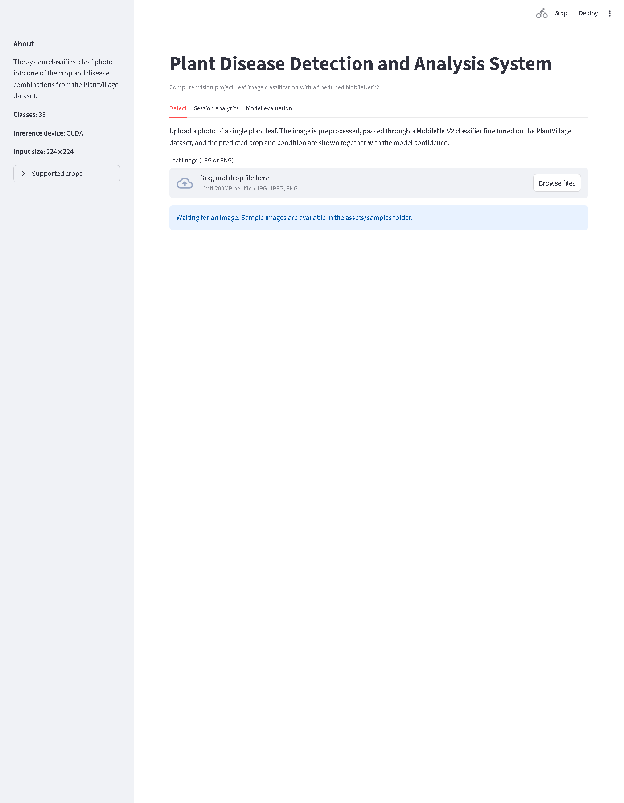

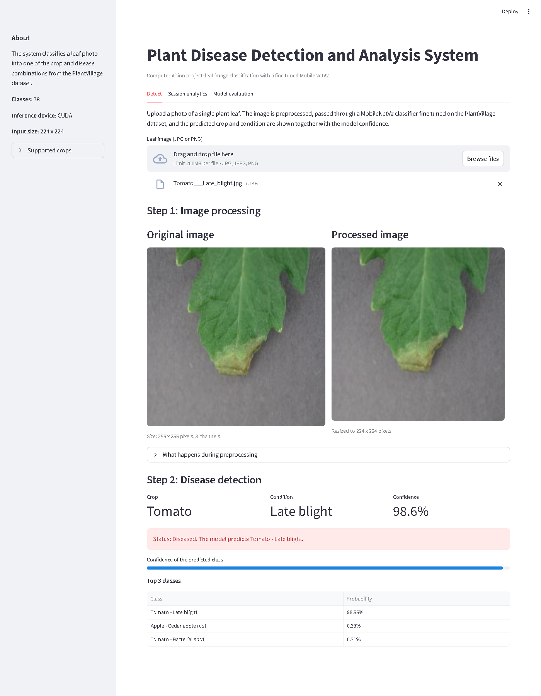

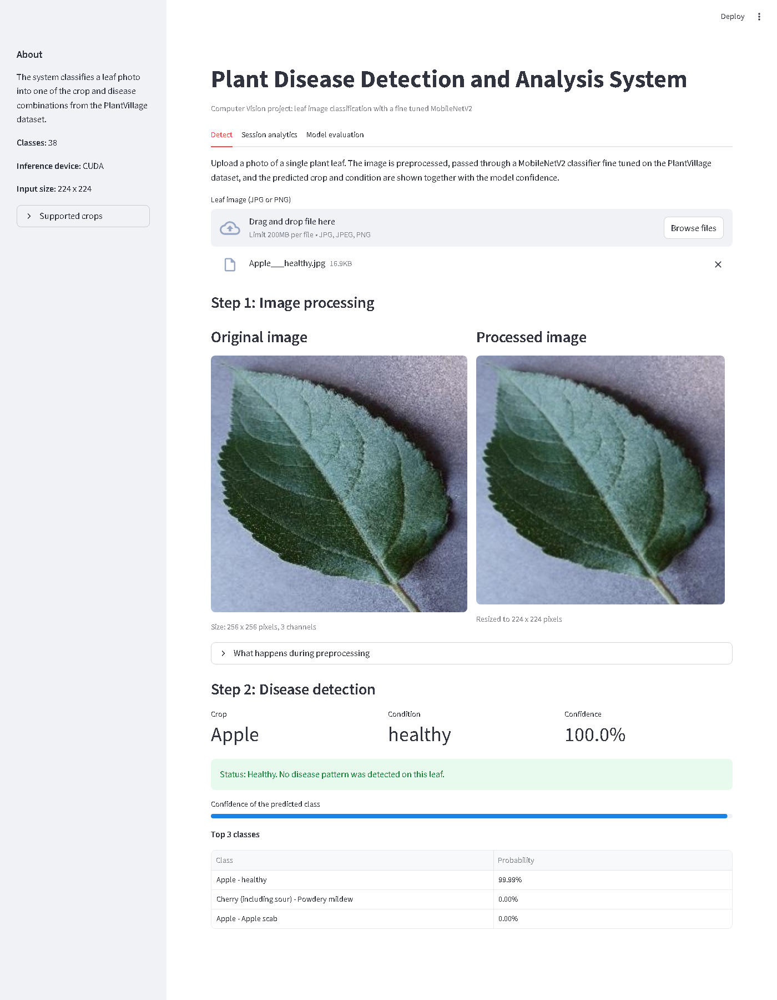

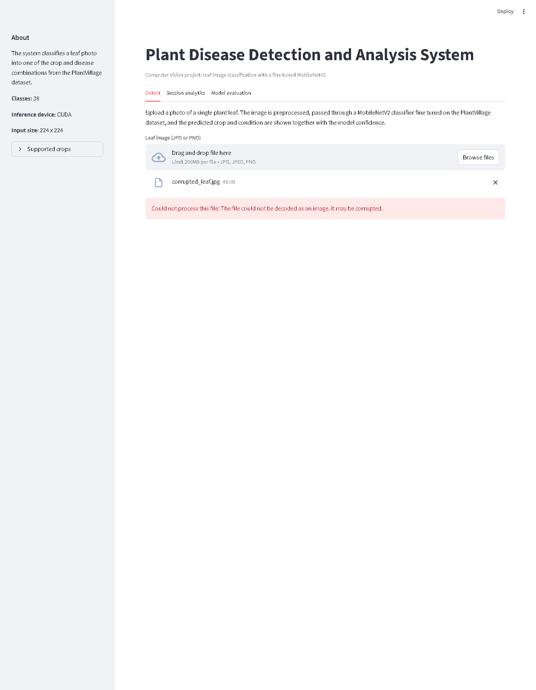

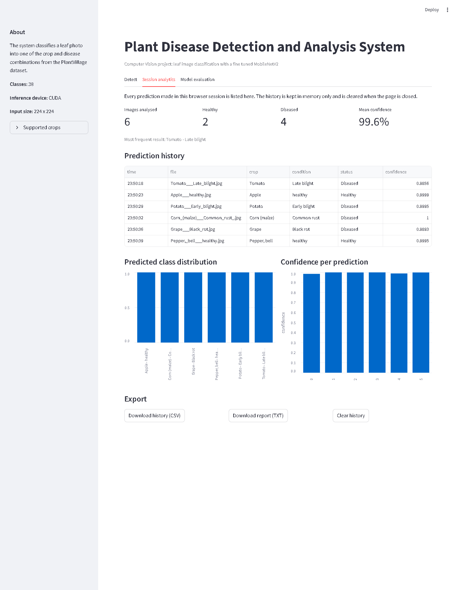

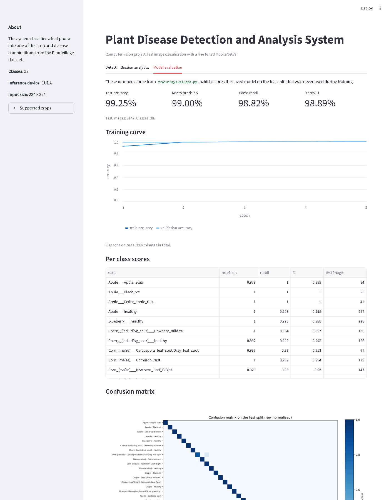

## 10.5 Duplicate Images in PlantVillage

Hashing the bytes of all 54,305 files found 54,284 unique contents, so the raw PlantVillage release contains 21 exact duplicate files. The split treats every file as a separate image, so a duplicated photo can land in two splits: 4 test images and 4 validation images have a byte identical copy in the training set. The 4 affected test images (2 Tomato healthy, 1 Tomato late blight, 1 Apple healthy) all carry the same label as their training copy and are all predicted correctly. Excluding them changes the test accuracy from 8,086 / 8,147 to 8,082 / 8,143, which is still 99.25%.

PlantVillage is also known to contain near duplicate photographs of the same leaf taken from slightly different positions (Mohanty et al., 2016; Noyan, 2022). Those are not detected by hashing and were not filtered, and they are part of the reason accuracies on this dataset are high for most published models. The 99.25% figure should therefore be read as accuracy on this dataset's held out split under these conditions, not as expected accuracy on photographs taken in the field.

# 11. Testing Approach

Tests are written with pytest and live in the `tests/` folder, organised by functional module. The preprocessing and analytics tests use small synthetic images generated in `conftest.py` (a green ellipse on a light background) so they run in a few seconds without the dataset. The prediction tests use an untrained MobileNetV2 body for shape and range checks, and one test loads the real trained weights. The application test runs `app.py` through Streamlit's `AppTest` runner, which executes the script exactly as `streamlit run` would and records any exception.

Table 12: Unit tests and what each checks

| Test | What it checks |
|------|----------------|
| `test_valid_jpg_and_png_are_accepted` | jpg, JPEG (case insensitive) and png pass validation |
| `test_unsupported_extension_is_rejected` | txt and gif raise `ImageValidationError` with an "Unsupported file type" message |
| `test_empty_and_oversized_files_are_rejected` | 0 byte files and files over 10 MB are rejected with specific messages |
| `test_corrupted_bytes_raise_a_clear_error` | random bytes that are not an image raise an error mentioning corruption |
| `test_decode_returns_rgb_uint8` | decoded array is uint8, keeps the original size, and channels are RGB not BGR |
| `test_grayscale_png_is_expanded_to_three_channels` | a single channel PNG becomes (H, W, 3) |
| `test_resize_produces_square_output` | output is exactly 224 x 224 x 3 uint8 |
| `test_normalisation_matches_imagenet_formula` | a white pixel becomes (1 - mean) / std per channel, float32 |
| `test_preprocess_image_tensor_layout` | the final tensor is a float32 torch tensor of shape (3, 224, 224) |
| `test_preprocess_upload_end_to_end` | the app wrapper returns original, resized image and a (1, 3, 224, 224) tensor |
| `test_preprocess_upload_rejects_bad_extension` | the wrapper applies the extension check before decoding |
| `test_build_model_output_size` | MobileNetV2 with a replaced head outputs one logit per class |
| `test_predict_returns_valid_result` | `predict` returns a `PredictionResult`, confidence is in [0, 1], top 3 is sorted descending |
| `test_healthy_flag_follows_class_name` | `is_healthy` is true exactly when the class name ends in "healthy" |
| `test_predict_rejects_batches` | a tensor with batch size 2 raises `ValueError` |
| `test_missing_weights_give_clear_error` | loading from a folder without weights raises `FileNotFoundError` that names `train.py` |
| `test_trained_model_loads_and_predicts` | the real saved weights load and produce a valid prediction |
| `test_class_name_helpers` | `Crop___Condition` folder names are split and formatted correctly |
| `test_empty_history_summary` | empty history gives an empty table, zero counts and no most common class |
| `test_summary_counts_and_confidence` | totals, healthy and diseased counts, mean, min, max confidence and most common label |
| `test_text_report_lists_every_prediction` | the text report contains the totals, every file name, the class name and the confidence |
| `test_app_starts_without_errors` | `app.py` runs under `AppTest` with no exception, shows the title, three tabs, and an empty history |

Result of the final run of `python -m pytest tests -v` on 11 September 2026: 22 passed, 0 failed, 0 skipped, in 14.93 seconds. The suite was run once more after the last edits to `app.py`: 22 passed in 10.99 seconds.

## 11.1 Browser Level Tests

Upload behaviour cannot be automated with `AppTest` because it does not support file uploads, so the script `tests/browser_check.py` drives the real app in a headless Chromium browser (Playwright). It uploads files through the actual uploader widget, reads the page text and prints PASS or FAIL for each check.

Table 13: Browser checks and observed results

| Case | Observed |
|------|----------|
| Home page | loaded, model loaded on CUDA, sidebar shows 38 classes |
| Upload `Tomato___Late_blight.jpg` | Crop Tomato, Condition Late blight, Confidence 98.6%, red "Diseased" banner |
| Upload `Apple___healthy.jpg` | Crop Apple, Condition healthy, Confidence 100.0%, green "Healthy" banner |
| Upload a text file renamed to `corrupted_leaf.jpg` | red message "Could not process this file: The file could not be decoded as an image. It may be corrupted." App kept running |
| Six valid uploads, then switch tabs Detect / Analytics / Detect / Analytics | Images analysed 6, Healthy 2, Diseased 4, mean confidence 99.6%. No duplicate rows |
| Session analytics tab | CSV and TXT download buttons present |
| Model evaluation tab | Test accuracy 99.25% shown, confusion matrix section present |
| Clear history | "No predictions yet" message shown afterwards |

Result: 8 of 8 checks passed. One further case was run by hand through `AppTest` with the `models/` folder temporarily renamed: the app showed the message "Trained model not found. Run `python training/train.py` first" and raised no exception.

The first run of the browser script found a real bug: after "Clear history" the file still sitting in the uploader was added to the history again on the rerun, because the id of the last recorded upload was reset together with the list. The fix keeps that id when the list is cleared.

# 12. Challenges Faced

1. Getting the data onto the machine took several attempts. The dataset is about 1 GB of small JPEG files. A single sparse git checkout failed twice on a slow Wi-Fi link, and one stalled transfer left a lock file that blocked every later attempt. What worked was fetching one class folder at a time in a retry loop and setting `http.lowSpeedLimit` so git aborts a stalled connection instead of waiting forever.
2. A plain `pip install torch` gives a CPU only build. Training 38,000 images per epoch on the CPU would have taken hours, so the CUDA build had to be installed from the PyTorch index. Once torch and torchvision were both CUDA builds the GPU trained an epoch in about four minutes.
3. Keeping training and inference preprocessing identical needed deliberate effort. It is easy to resize with PIL in training and OpenCV in the app, or to forget normalisation in one place. The fix was a single `preprocess_image` function that both the Dataset class and the app call, plus a unit test that checks the normalisation formula.
4. Class folder names contain spaces and punctuation. Names like `Corn_(maize)___Cercospora_leaf_spot Gray_leaf_spot` and `Pepper,_bell___healthy` broke a shell loop and needed quoting. In Python the names are only used as dictionary keys and labels, so `split_class_name` just replaces underscores and does not try to be clever.
5. Streamlit produced duplicate history rows. It reruns the whole script on every widget interaction, so a naive `history.append` added the same upload again each time the user switched tabs. The app now stores the id of the last recorded upload in session state and only appends when it changes. A browser level test later caught a second version of the same problem: the clear history button also reset that id, so the upload still in the widget was re-added right after clearing.
6. The data loader is slow on Windows. With 4 worker processes the GPU was only partly busy because JPEG decoding is the bottleneck. This is acceptable for a project of this size, but it is the reason the epochs take four minutes rather than one.
7. The dataset itself contains duplicate images. Hashing every file after training showed 21 exact duplicates in PlantVillage, a few of which cross the split boundary. Their effect on the test score was measured (section 10.5) and reported rather than removed after the fact.

# 13. Learnings and Key Takeaways

* Transfer learning is far more efficient than training from scratch for this kind of problem. One epoch of fine tuning already reached 98% validation accuracy.
* Accuracy on PlantVillage is high for almost any reasonable CNN, so the confusion matrix and per class scores are more informative than the headline number. They show exactly which diseases are visually similar.
* A held out test set and a saved split file are what make the reported numbers trustworthy. Without them it is easy to evaluate on images the model has seen. Checking for duplicate content, not only duplicate paths, is part of that.
* Augmentation makes training accuracy lower than validation accuracy, which looks odd at first but is a sign the augmentation is doing something.
* Error handling for user input (wrong file type, corrupted bytes, missing model) needs the same care as the model itself, because those are the cases a demo will actually hit.
* Softmax confidence is useful but not calibrated: an image of a crop that is not in the dataset can still get a high probability for the nearest looking class.
* Tests that drive the real interface find bugs that unit tests miss. The clear history bug only appeared when a browser reran the script.

# 14. Future Enhancements

* Fine tune again on photos taken outdoors, since PlantVillage backgrounds are uniform.
* Remove exact and near duplicate images by content before creating the split, so that no test image has a twin in training.
* Add an "unknown" decision when the maximum probability is low or when the image is not a leaf, using a threshold tuned on a validation set of out of distribution photos.
* Add Grad-CAM heatmaps to show which part of the leaf drove the prediction. This would help verify the model looks at lesions rather than background.
* Segment the leaf from the background before classification so that the classifier receives less irrelevant context.
* Export the model to ONNX or TorchScript and run it on a phone.
* Store predictions in SQLite if a multi session record is ever needed. That would then require a schema and an ER diagram.

# 15. References

1. D. P. Hughes and M. Salathe, "An open access repository of images on plant health to enable the development of mobile disease diagnostics", arXiv:1511.08060, 2015. (PlantVillage dataset.)
2. PlantVillage dataset mirror used in this project: https://github.com/spMohanty/PlantVillage-Dataset
3. M. Sandler, A. Howard, M. Zhu, A. Zhmoginov and L. C. Chen, "MobileNetV2: Inverted Residuals and Linear Bottlenecks", IEEE Conference on Computer Vision and Pattern Recognition (CVPR), 2018.
4. PyTorch documentation, torchvision.models.mobilenet_v2: https://pytorch.org/vision/stable/models/mobilenetv2.html
5. OpenCV documentation: https://docs.opencv.org/
6. scikit-learn documentation, classification metrics: https://scikit-learn.org/stable/modules/model_evaluation.html
7. Streamlit documentation: https://docs.streamlit.io/
8. VITyarthi, "Build Your Own Project: General Project Instructions and Submission Guidelines" (course document).
9. M. A. Noyan, "Uncovering bias in the PlantVillage dataset", arXiv:2206.04374, 2022.
10. S. P. Mohanty, D. P. Hughes and M. Salathe, "Using Deep Learning for Image-Based Plant Disease Detection", Frontiers in Plant Science, 2016.
